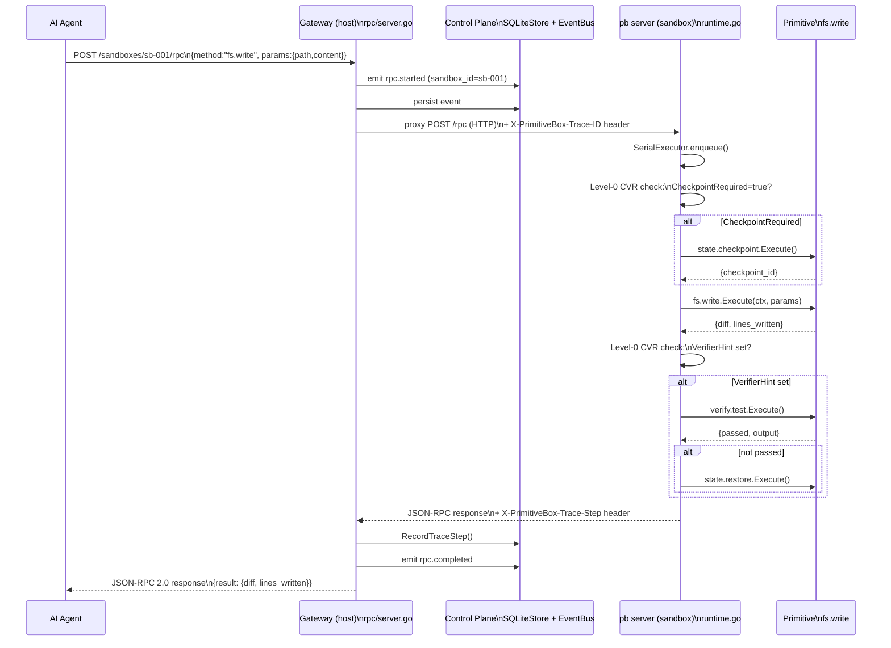
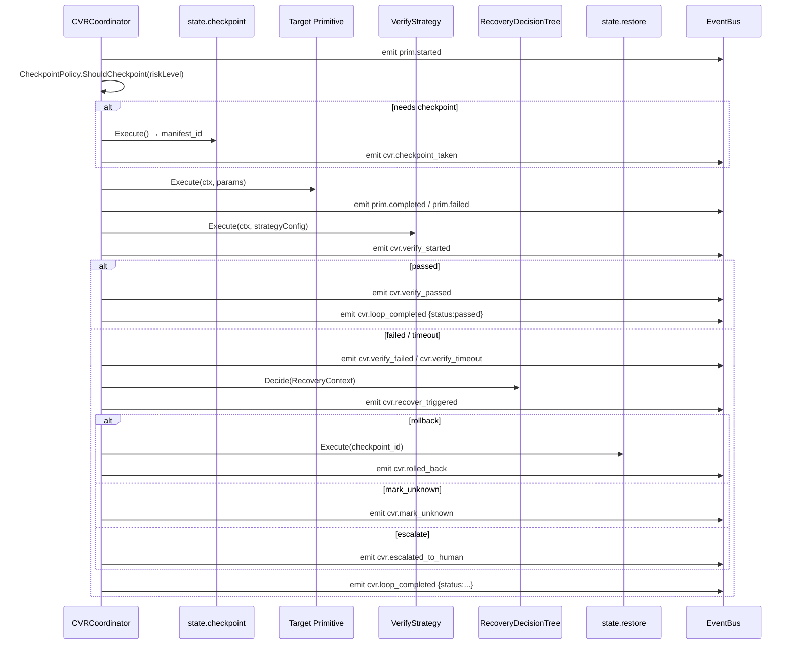

# PrimitiveBox System Architecture

**Document:** `docs/arch/05_system_architecture.md`
**Status:** Authoritative Architecture Reference
**Synthesises:** `01_primitive_taxonomy.md`, `02_app_primitive_protocol.md`, `03_cvr_loop.md`, `04_event_observability.md`

---

## 5.1 System Architecture Diagram

### 5.1.1 Full System — Component and Data Flow

```mermaid
graph TB
    subgraph EXTERNAL["External Actors"]
        AI["AI Agent\n(LLM / Orchestrator)"]
        HU["Human Operator\n(CLI / Browser)"]
        SDK["Python / Go SDK"]
    end

    subgraph HOST["Host Machine (control plane boundary)"]
        CLI["cmd/pb\nCLI Entry Point\n──────────────\n• dependency wiring\n• config loading\n• cobra commands"]

        subgraph GATEWAY["Gateway Layer  internal/rpc/"]
            RPC["JSON-RPC 2.0 Server\n──────────────\nPOST /rpc\nPOST /rpc/stream\nGET  /api/v1/*\nSSE  /api/v1/events/stream"]
        end

        subgraph CTRLPLANE["Control Plane  internal/control/ + internal/eventing/"]
            STORE["SQLiteStore\n──────────────\n• sandboxes table\n• events table\n• trace_steps table\n• trace_spans table\n• checkpoint_manifests table"]
            BUS["Event Bus\n──────────────\n• publish / subscribe\n• SSE fan-out\n• persist-first\n• MultiSink"]
        end

        subgraph SANDBOXMGR["Sandbox Management  internal/sandbox/"]
            MGR["SandboxManager\n──────────────\n• Create / Start / Stop\n• Destroy / Inspect\n• TTL reaper\n• health polling"]
            ROUTER["RouterDriver\n──────────────\n• name → driver map\n• resolver func\n• driver delegation"]
            DOCKER["DockerDriver\n──────────────\n• container lifecycle\n• workspace mount\n• port allocation"]
            K8S["KubernetesDriver\n──────────────\n• pod lifecycle\n• PVC binding\n• namespace isolation"]
        end

        subgraph ORCH["Orchestrator  internal/orchestrator/"]
            ENGINE["Engine\n──────────────\n• RunTask loop\n• step retry\n• recovery policy"]
            REPLAY["Replay\n──────────────\n• ReplayMode enum\n• PrintReplay\n• ReplayEntry"]
            RECOVERY["RecoveryPolicy\n──────────────\n• Decide()\n• ActionRetry\n• ActionPause"]
        end

        AUDIT["Audit Logger\n  internal/audit/"]
    end

    subgraph SANDBOX["Sandbox Container (execution plane — isolated)"]
        subgraph PBSERVER["pb server  internal/runtime/"]
            RT["Runtime\n──────────────\n• registerSystemPrimitives\n• loadAdapters\n• SerialExecutor\n• TraceWriter\n• Level-0 CVR"]
            RTADAPT["AdapterProcess\n──────────────\n• manifest.json loader\n• stdout-first-line reg\n• HTTP+Unix proxy\n• remotePrimitive"]
        end

        subgraph PRIMREG["Primitive Registry  internal/primitive/"]
            REG["Registry\n──────────────\n• Get / List / Schemas\n• RegisterDefaults\n• RegisterSandboxExtras\n• RWMutex"]
            META["Schema Metadata\n──────────────\n• EnrichSchema\n• SideEffect inference\n• CheckpointRequired\n• VerifierHint"]
        end

        subgraph PRIMS["System Primitives  internal/primitive/"]
            FS["fs.*\nread/write/list/diff"]
            SHELL["shell.exec\nallowedCommands\nstreaming output"]
            STATE["state.*\ncheckpoint/restore/list\ngit-backed"]
            VERIFY["verify.test\nexit-code pass/fail\ntest summary"]
            CODE["code.*\nsearch/read_symbol\npatch_symbol/run_tests"]
            MACRO["macro.safe_edit\ncheckpoint→write\n→verify→restore"]
            DB["db.*\n(experimental)"]
            BROWSER["browser.*\n(experimental)"]
        end

        subgraph APPEXT["Application Primitive Extension (proposed — 02_app_primitive_protocol.md)"]
            APPROUTER["AppRouter\n──────────────\n• nameIndex map\n• AppRoute lifecycle\n• health polling\n• conflict resolution"]
            APPSERVER["App Primitive Server\n(user-deployed process)\n──────────────\n• Unix socket reg\n• @server.primitive()\n• JSON-RPC dispatch"]
        end

        subgraph CVRPKG["CVR Coordinator  internal/cvr/ (proposed — 03_cvr_loop.md)"]
            CVRC["CVRCoordinator\n──────────────\n• CheckpointPolicy\n• VerifyStrategy dispatch\n• RecoveryDecisionTree\n• ExecuteWithRetry"]
            VERIFY_STRAT["VerifyStrategy\n──────────────\n• ExitCodeStrategy\n• TestSuiteStrategy\n• SchemaCheckStrategy\n• AIJudgeStrategy\n• CompositeStrategy"]
            RECOVER_TREE["RecoveryDecisionTree\n──────────────\n• 12-step priority tree\n• MarkUnknown\n• fallback_earlier"]
        end

        RUNTRACE_SB["runtrace\n──────────────\n• StepRecord\n• Recorder\n• EncodeHeader\nX-PrimitiveBox-Trace-Step"]
    end

    subgraph CLIENTSIDE["Client Side"]
        PYSDK["Python SDK\n  sdk/python/\n──────────────\n• PrimitiveBoxClient\n• AsyncPrimitiveBoxClient\n• fs / shell / state wrappers"]
    end

    %% External → Gateway
    AI -->|"POST /sandboxes/{id}/rpc\nJSON-RPC 2.0"| RPC
    HU -->|"pb sandbox create\npb server start"| CLI
    SDK -->|"HTTP POST"| RPC
    PYSDK -->|"HTTP POST"| RPC

    %% CLI wires everything
    CLI -->|"dependency injection"| RPC
    CLI -->|"configure"| MGR
    CLI -->|"configure"| STORE

    %% Gateway → Control Plane
    RPC -->|"persist events"| STORE
    RPC -->|"publish events"| BUS
    RPC -->|"sandbox ops"| MGR
    RPC -->|"audit log"| AUDIT
    BUS -->|"SSE fan-out\nevents/stream"| RPC

    %% Gateway → Sandbox (proxy)
    RPC -->|"POST /rpc\nproxy over HTTP"| RT

    %% Control Plane
    STORE <-->|"implements eventing.Store\nruntrace.Store"| BUS

    %% Sandbox Manager
    MGR -->|"lifecycle ops"| ROUTER
    ROUTER -->|"route by driver name"| DOCKER
    ROUTER -->|"route by driver name"| K8S
    MGR -->|"persist state"| STORE
    MGR -->|"emit sandbox.* events"| BUS

    %% Orchestrator (host-side)
    ENGINE -->|"Execute(ctx, method, params)\nvia PrimitiveExecutor"| RPC
    ENGINE -->|"Decide(failureKind)"| RECOVERY

    %% pb-server internals
    RT -->|"Execute"| REG
    RT -->|"Level-0 CVR\ncheckpoint if required"| STATE
    RT -->|"Level-0 CVR\nverify if hinted"| VERIFY
    REG -->|"registered primitives"| PRIMS
    META -->|"enriches schema"| REG

    %% CVR (proposed)
    CVRC -->|"delegates to"| VERIFY_STRAT
    CVRC -->|"delegates to"| RECOVER_TREE
    CVRC -->|"checkpoint/restore"| STATE
    CVRC -->|"emit cvr.* events"| RUNTRACE_SB
    RT -.->|"proposed:\ninject CVRCoordinator"| CVRC

    %% App extension (proposed)
    RTADAPT -->|"existing static path"| REG
    APPROUTER -.->|"proposed:\ndynamic registration"| REG
    APPROUTER -->|"dispatch via Unix socket"| APPSERVER
    RT -.->|"proposed:\nAppRouter integration"| APPROUTER

    %% Trace propagation
    RUNTRACE_SB -->|"X-PrimitiveBox-Trace-Step header"| RPC
    RPC -->|"X-PrimitiveBox-Trace-ID/Span-ID header"| RT

    style EXTERNAL fill:#f0f4ff,stroke:#9ab
    style HOST fill:#fff8f0,stroke:#ca8
    style SANDBOX fill:#f0fff4,stroke:#8ca
    style CLIENTSIDE fill:#f9f0ff,stroke:#a8c
    style APPEXT fill:#fffde7,stroke:#c8a,stroke-dasharray: 5 5
    style CVRPKG fill:#e8f5e9,stroke:#6a9,stroke-dasharray: 5 5
```



---

### 5.1.2 Request Flow — AI Agent Executes `fs.write` in Sandbox



---

### 5.1.3 CVR Loop Flow (proposed `internal/cvr/`)



---

## 5.2 Module Boundary Definitions

### Legend

- **Layer:** `gateway` | `control-plane` | `sandbox-runtime` | `primitive` | `orchestrator` | `sdk` | `cli`
- **Interface:** Go interface name or HTTP surface — not the implementing struct
- **Deps:** one-way imports only; circular dependencies are forbidden

---

### Module: `cmd/pb`

| Field | Value |
|---|---|
| **Layer** | cli |
| **Responsibility** | CLI entry point; wires all dependencies explicitly; cobra command tree |
| **Exposes** | `main()`, cobra `Command` tree, `pb server start`, `pb sandbox *` |
| **Depends on** | `internal/rpc`, `internal/control`, `internal/sandbox`, `internal/eventing`, `internal/audit` |
| **Must NOT contain** | Business logic; primitive implementations; direct SQLite queries; sandbox driver code |

---

### Module: `internal/rpc`

| Field | Value |
|---|---|
| **Layer** | gateway |
| **Responsibility** | HTTP/JSON-RPC 2.0 server; SSE streaming; sandbox proxy; Inspector API; span/trace header propagation |
| **Exposes** | `Server` struct; `Handler() http.Handler`; `AttachEventing(bus, store)` |
| **Depends on** | `internal/primitive` (Registry, Schema), `internal/eventing`, `internal/sandbox`, `internal/runtrace`, `internal/audit` |
| **Must NOT contain** | Primitive business logic; direct SQLite access; sandbox container operations; workspace file operations; trace storage implementation |

---

### Module: `internal/control`

| Field | Value |
|---|---|
| **Layer** | control-plane |
| **Responsibility** | Durable SQLite state for sandboxes, events, trace steps, trace spans, checkpoint manifests |
| **Exposes** | `SQLiteStore` implementing `eventing.Store`, `runtrace.Store`, `runtrace.TraceStore`, `sandbox.Store`, `cvr.CheckpointManifestStore` |
| **Depends on** | `internal/eventing`, `internal/runtrace`, `internal/sandbox` (Store interface only), `internal/cvr` (CheckpointManifest type only) |
| **Must NOT contain** | HTTP handlers; primitive execution; sandbox lifecycle management; event bus logic |

---

### Module: `internal/eventing`

| Field | Value |
|---|---|
| **Layer** | control-plane |
| **Responsibility** | Shared event model; in-memory pub/sub bus; context-bound sinks; `Event` struct |
| **Exposes** | `Event`, `Store` interface, `Sink` interface, `Bus`, `MultiSink`, `SinkFunc`, `WithSink`, `SinkFromContext`, `Emit`, `MustJSON` |
| **Depends on** | Standard library only |
| **Must NOT contain** | SQLite; HTTP; sandbox logic; primitive logic; any domain-specific event schema |

---

### Module: `internal/sandbox`

| Field | Value |
|---|---|
| **Layer** | control-plane / gateway |
| **Responsibility** | Sandbox lifecycle (create/start/stop/destroy/inspect); runtime driver abstraction; TTL/reaper; health polling |
| **Exposes** | `RuntimeDriver` interface, `Manager`, `RouterDriver`, `DockerDriver`, `KubernetesDriver`, `Store` interface, `Sandbox` struct, `SandboxStatus` |
| **Depends on** | `internal/eventing` (event emission only); Docker SDK; k8s client-go |
| **Must NOT contain** | JSON-RPC handling; primitive implementations; SQLite access (uses `Store` interface); workspace file operations |

---

### Module: `internal/primitive`

| Field | Value |
|---|---|
| **Layer** | primitive |
| **Responsibility** | Primitive contract (interface + schema); registry; all system primitive implementations; metadata enrichment |
| **Exposes** | `Primitive` interface, `Schema`, `Registry`, `Result`, `PrimitiveError`, `ExecContext`, `Options`; all primitive constructors (`NewFSRead`, `NewShellExec`, etc.) |
| **Depends on** | `internal/eventing` (Emit via context only); standard library; git CLI (via shell) |
| **Must NOT contain** | HTTP; SQLite; sandbox management; orchestrator logic; event bus wiring; trace propagation logic |

---

### Module: `internal/runtime`

| Field | Value |
|---|---|
| **Layer** | sandbox-runtime |
| **Responsibility** | Runs **inside the sandbox container** as `pb server`; owns `SerialExecutor`; Level-0 CVR; adapter loading; registry population |
| **Exposes** | `Runtime`, `Config`, `SerialExecutor`; implements `PrimitiveExecutor` implicitly |
| **Depends on** | `internal/primitive`, `internal/runtrace` |
| **Must NOT contain** | Control-plane SQLite; sandbox manager; gateway routing; orchestrator state; host-side event bus wiring |

---

### Module: `internal/runtrace`

| Field | Value |
|---|---|
| **Layer** | cross-cutting (both host and sandbox) |
| **Responsibility** | Distributed trace correlation; HTTP header encode/decode; `StepRecord`; `TraceSpan`/`ExecutionTrace` types; `TraceStore` interface |
| **Exposes** | `StepRecord`, `Recorder`, `WithRecorder`, `RecorderFromContext`, `EncodeHeader`, `DecodeHeader`, `Store` interface, `TraceStore` interface, `TraceSpan`, `ExecutionTrace`, header constants |
| **Depends on** | Standard library only |
| **Must NOT contain** | SQLite; HTTP handlers; primitive logic; event bus; sandbox management |

---

### Module: `internal/orchestrator`

| Field | Value |
|---|---|
| **Layer** | orchestrator |
| **Responsibility** | Task-level execution loop (plan→execute→verify→recover); step retry; failure classification; replay |
| **Exposes** | `Engine`, `PrimitiveExecutor` interface, `Task`, `Step`, `StepResult`, `StepError`, `TaskStatus`, `StepStatus`, `FailureKind`, `ReplayMode`, `Replay()` |
| **Depends on** | `internal/eventing` (for event emission); `internal/runtrace`; standard library |
| **Must NOT contain** | Primitive implementations; direct SQLite access; sandbox management; HTTP; workspace file operations |

---

### Module: `internal/cvr` (proposed)

| Field | Value |
|---|---|
| **Layer** | sandbox-runtime |
| **Responsibility** | CVR closed loop: checkpoint policy decisions, verify strategy dispatch, recovery decision tree, ExecuteWithRetry |
| **Exposes** | `CVRCoordinator` interface, `CVRRequest`, `CVRResult`, `CheckpointPolicy`, `VerifyStrategy` interface, `StrategyResult`, `RecoveryDecisionTree`, `CheckpointManifest`, `CheckpointManifestStore` interface |
| **Depends on** | `internal/primitive` (state/verify primitives), `internal/eventing`, `internal/runtrace` |
| **Must NOT contain** | HTTP; SQLite (uses `CheckpointManifestStore` interface); sandbox management; orchestrator logic; gateway code |

---

### Module: `internal/audit`

| Field | Value |
|---|---|
| **Layer** | gateway |
| **Responsibility** | Append-only structured audit log for all primitive calls |
| **Exposes** | `Logger`, `LogCall()`, `LogCallWithMetadata()` |
| **Depends on** | Standard library only |
| **Must NOT contain** | Event bus; SQLite; sandbox; HTTP |

---

### Module: `sdk/python`

| Field | Value |
|---|---|
| **Layer** | sdk |
| **Responsibility** | Sync and async Python clients; primitive wrappers; SDK-level retry/streaming |
| **Exposes** | `PrimitiveBoxClient`, `AsyncPrimitiveBoxClient`, `fs.*`, `shell.*`, `state.*` wrappers |
| **Depends on** | `httpx` (HTTP), `aiohttp` (async HTTP) |
| **Must NOT contain** | Go types; direct SQLite access; container management; server-side logic |

---

### Dependency Matrix (allowed import directions only)

```
cmd/pb
  └── internal/rpc
        └── internal/primitive  ←── internal/eventing
        └── internal/sandbox    ←── internal/eventing
        └── internal/runtrace
        └── internal/audit
        └── internal/eventing
  └── internal/control          ←── internal/eventing
                                ←── internal/runtrace
                                ←── internal/sandbox  (Store iface only)
  └── internal/eventing
  └── internal/sandbox
  └── internal/orchestrator     ←── internal/eventing
                                ←── internal/runtrace

[inside sandbox container]
internal/runtime
  └── internal/primitive        ←── internal/eventing
  └── internal/runtrace
  └── internal/cvr (proposed)   ←── internal/primitive
                                ←── internal/eventing
                                ←── internal/runtrace

Forbidden cycles (examples):
  ✗ internal/primitive → internal/runtime
  ✗ internal/eventing → internal/control
  ✗ internal/sandbox → internal/rpc
  ✗ internal/cvr → internal/orchestrator
  ✗ internal/runtrace → internal/eventing
  ✗ internal/cvr → internal/control  (control implements cvr interfaces, not the reverse)

# Note: internal/control → internal/cvr IS allowed and required.
# internal/control implements cvr.CheckpointManifestStore, so it imports
# internal/cvr for the interface type and CheckpointManifest struct.
# Verified acyclic: internal/cvr → internal/primitive → internal/eventing (no loop).

# AIJudgeStrategy recursion note:
# CVRCoordinator → AIJudgeStrategy.Run() → primitive.Execute(judge_primitive)
# This creates a runtime call from cvr layer back into the primitive layer.
# Go import direction: internal/cvr imports internal/primitive via PrimitiveExecutor
# interface (injected at construction time), not a circular import.
# Runtime recursion is prevented by CVRRequest.CVRDepth > 0 guard (see 03_cvr_loop.md §2.8).
```

---

## 5.3 Architecture Decision Records (ADRs)

---

### ADR-001: SQLite as Control-Plane Storage

**Status:** Accepted

**Context:**
PrimitiveBox needs a durable store for control-plane state: sandbox records, persisted event history, trace steps, and checkpoint manifests. The store is accessed only by the host gateway process — never directly by sandboxes. The primary workload is write-append (events, trace steps) plus point-lookups by ID and range queries by sandbox_id + timestamp. The deployment target is a single-host binary that operators run on a developer laptop, CI runner, or a dedicated server — not a horizontally-scaled fleet.

**Decision:**
Use SQLite via `modernc.org/sqlite` (pure-Go, no CGO) as the sole control-plane store.

**Rationale:**

1. **Operational simplicity:** SQLite requires zero infrastructure. The entire control plane fits in one `.primitivebox/db.sqlite` file that moves with the workspace. No connection pooling, no separate process, no authentication configuration.

2. **Single-writer model matches the use case:** The gateway is a single process. SQLite's single-writer model is not a limitation; it is a fit. Event appends are serialised through the same goroutine path that handles RPC calls.

3. **ACID guarantees without a network hop:** Every sandbox lifecycle mutation and event emission is transactional. Rolling back a checkpoint and emitting a `cvr.rolled_back` event happen in the same SQLite transaction — impossible with a remote database without distributed transaction overhead.

4. **`modernc.org/sqlite` removes the CGO boundary:** The CGO-free driver means `go build` produces a single static binary with no external `.so` dependency. This is essential for the Docker sandbox image build.

5. **Schema evolution is tractable at this scale:** The number of rows per table is bounded by the operational lifetime of a single gateway instance. Events are pruned by time or count. No table will realistically exceed tens of millions of rows in the target deployment scenario.

**Rejected alternatives:**

| Alternative | Why rejected |
|---|---|
| PostgreSQL | Requires a running Postgres server; defeats the "zero-infra local binary" goal. Adds 5–10ms per write for network round-trip on local deployments. Appropriate if PrimitiveBox becomes a multi-node cloud service — revisit then. |
| BoltDB / BadgerDB | Key-value stores lack native SQL query planner. Complex event queries (join sandbox + events + trace_steps) would require application-level joins. |
| In-memory only | Control-plane state is lost on process restart. Sandbox records and event history must survive crashes. |
| Embedded etcd | Heavyweight RAFT consensus not needed for single-node control plane. |

**Consequences:**

- **Positive:** Zero external dependencies; single-binary deployment; ACID writes; portable workspace.
- **Positive:** Full SQL query expressiveness for Inspector API event filtering.
- **Negative:** Not horizontally scalable; cannot serve multiple gateway instances concurrently (write contention). If PrimitiveBox ever requires HA multi-gateway, SQLite must be replaced — accept this as a known future migration.
- **Negative:** Concurrent read performance degrades under heavy Inspector API load. Mitigate with WAL mode and connection pool cap.

---

### ADR-002: `pb server` Runs Inside the Sandbox, Not on the Host

**Status:** Accepted

**Context:**
PrimitiveBox primitives perform side-effectful operations: writing files, running shell commands, executing database queries, controlling browsers. These operations need a workspace context. There are two viable placements: (A) the host gateway executes primitives against a mounted/mapped workspace, or (B) each sandbox runs its own `pb server` that executes primitives against its local workspace.

**Decision:**
All workspace-touching primitive execution must run inside the sandbox container via a sandbox-local `pb server` process. The host gateway is the control-plane boundary only — it proxies RPC calls but does not execute primitives against sandbox workspaces.

**Rationale:**

1. **Isolation by default:** Multiple AI agents working on independent tasks each get a fully isolated filesystem, process space, and network namespace. A `shell.exec` in sandbox A cannot observe or mutate sandbox B's workspace, regardless of what the AI agent requests.

2. **Blast radius containment:** If a primitive runs a destructive command (e.g., `rm -rf /`), the damage is contained inside the sandbox container. With host-side execution, the same command could damage the operator's machine.

3. **Consistent execution environment:** The sandbox image defines the exact tool versions (go, python, node, git, etc.) available to primitives. Host-side execution would inherit whatever is installed on the operator's machine, producing environment-specific failures that are hard to reproduce.

4. **Clean host/sandbox contract:** The host gateway's contract is: validate → persist → route → proxy. This boundary is simple to reason about. If the gateway also executed primitives, every primitive would need to know whether it is running on the host or in a sandbox, complicating schema and security logic.

5. **Checkpoint semantics are workspace-local:** `state.checkpoint` calls `git add -A && git commit` inside the workspace. This is a local git operation that must run where the workspace files live — inside the sandbox. Executing checkpoint from the host over a mounted volume would introduce race conditions and NFS/overlay filesystem issues.

**Rejected alternatives:**

| Alternative | Why rejected |
|---|---|
| Host gateway executes all primitives against mounted workspace | Eliminates isolation. A single compromised prompt can damage the host machine. Unacceptable for any multi-tenant or security-sensitive use case. |
| Gateway executes low-risk primitives (fs.read) locally, routes risky ones to sandbox | Risk classification at the gateway requires knowledge of primitive semantics. Blurs the host/sandbox boundary. Classification errors cause security bypasses. |
| Primitives run as separate processes spawned by the gateway | Process isolation without container namespaces provides no filesystem or network isolation. Weaker than container isolation for same cost. |

**Consequences:**

- **Positive:** Strong isolation; consistent environments; blast-radius containment; clean host/sandbox contract.
- **Positive:** Horizontal scaling becomes possible: multiple sandboxes run independently; the gateway is stateless w.r.t. primitive execution.
- **Negative:** Each sandbox must have a `pb server` binary. The sandbox Docker image must include `pb server` — maintained as `make sandbox-image`.
- **Negative:** Host workspace mode (`POST /rpc`) is a first-class escape hatch where the gateway itself executes primitives. This mode must be explicitly opt-in and documented as "no sandbox isolation." It exists for developer convenience, not production AI workflows.
- **Negative:** Sandbox startup latency: Docker container creation adds 1–3 seconds before the first primitive call. Acceptable for task-level granularity; not suitable for per-call sandboxing.

---

### ADR-003: Unix Socket + JSON-RPC 2.0 for Application Primitive Registration

**Status:** Proposed (see `02_app_primitive_protocol.md`)

**Context:**
Application primitives allow user-deployed processes inside the sandbox to register custom primitives with `pb-runtimed`. The registration protocol must work inside the container isolation boundary (no host networking), be lightweight (no large dependencies), and integrate with the existing JSON-RPC 2.0 primitive dispatch path.

**Decision:**
Use Unix domain sockets as the transport layer, with JSON-RPC 2.0 as the wire protocol for both registration and primitive dispatch. Apps push a registration message to `pb-runtimed`'s Unix socket path (`/var/run/primitivebox/registry.sock`). The runtime health-polls registered apps via their own Unix sockets.

**Rationale:**

1. **Container-native transport:** Unix sockets work entirely within the container's network namespace. No port allocation, no `localhost` confusion with port forwarding, no CNI configuration required. The socket path is a file in a shared directory — the simplest possible IPC mechanism inside a container.

2. **JSON-RPC 2.0 reuses the existing primitive dispatch stack:** The `remotePrimitive` type in `internal/runtime/adapter.go` already proxies primitive calls over HTTP+Unix. JSON-RPC 2.0 framing is identical to the gateway's existing RPC protocol, meaning app primitive servers can be tested with the same tools used to test system primitives.

3. **Lightweight SDK:** The Python `AppServer` class needs only `socket` (stdlib) and `json` (stdlib) for the registration and dispatch loop. No gRPC dependency, no HTTP framework, no service mesh. Total SDK size for app primitive support: ~200 lines.

4. **Push registration with pull health-check:** Apps push their registration once at startup. `pb-runtimed` polls health via a `/health` endpoint on the app's socket. This model handles app restarts gracefully: the app re-registers on startup; `pb-runtimed` evicts the route after `N` consecutive health failures.

5. **Protocol reuse reduces attack surface:** JSON-RPC 2.0 is already validated, tested, and understood by the codebase. Adding a second protocol (e.g., gRPC) would require proto compilation, a gRPC server, and separate validation logic.

**Rejected alternatives:**

| Alternative | Why rejected |
|---|---|
| TCP REST (localhost:port) | Port conflicts in multi-app scenarios; no port allocation authority inside the container; requires NAT/port-forwarding configuration when host needs to reach app servers. |
| gRPC over Unix socket | Adds `google.golang.org/grpc` (~1MB) and protoc toolchain dependency. Proto schemas require compilation step. No benefit over JSON-RPC for single-process IPC. |
| Named pipes / FIFO | Uni-directional; cannot do request-response without two FIFOs. Complex lifecycle. |
| Shared memory | No language-agnostic framing standard; complex synchronisation; not portable across container runtimes. |
| Polling by app (app calls pb-runtimed to fetch work) | Inverts the control flow. Requires `pb-runtimed` to maintain a per-app work queue. Adds latency and complexity. |

**Consequences:**

- **Positive:** Zero external dependencies; works in any container runtime; reuses existing RPC tooling.
- **Positive:** Backward compatible: static `manifest.json` registration path preserved alongside dynamic socket registration.
- **Negative:** Unix sockets require a shared filesystem path. The socket directory (`/var/run/primitivebox/`) must be created by the sandbox startup script.
- **Negative:** No built-in authentication between app and `pb-runtimed`. Mitigated by filesystem permission on the socket path (owned by the `pb` user). Cross-process trust inside a single container is acceptable — app code runs with the same UID as `pb-runtimed`.
- **Negative:** No multiplexing: each app server needs its own socket file. The `nameIndex` in `AppRouter` maps primitive names to socket paths; O(1) dispatch still holds.

---

### ADR-004: Git-Backed Filesystem Checkpoints

**Status:** Accepted

**Context:**
`state.checkpoint` must capture workspace state before side-effectful primitive execution so that `state.restore` can roll back to a known-good state. The workspace is a directory tree of source files. Checkpoint storage options range from full directory snapshots (tar archives, object storage) to version-control-backed approaches (git commits, btrfs snapshots).

**Decision:**
Use git commits as the checkpoint storage mechanism. `state.checkpoint` runs `git add -A && git commit -m "checkpoint: <label>"` inside the workspace. `state.restore` runs `git checkout <commit> -- .` and `git clean -fdx`. The commit hash is the checkpoint ID.

**Rationale:**

1. **Git is already present in every workspace:** AI agent use cases (code editing, refactoring, test fixing) universally operate on git repositories. The workspace is already a git repo. No additional tooling needs to be installed.

2. **Content-addressable deduplication:** Git stores file content as blobs, not full copies. Two checkpoints that differ by one file share all unchanged blobs. Storage cost scales with delta, not full workspace size.

3. **Human-readable history:** The checkpoint sequence is visible via `git log`. Developers can inspect, diff, or manually cherry-pick between checkpoints using standard git tools. No proprietary snapshot format to learn.

4. **Atomic commit semantics:** A git commit is either fully written (all blobs + tree + commit object) or not written at all. There is no partial-checkpoint state. `state.restore` to a commit hash is guaranteed to produce a consistent workspace.

5. **`CheckpointManifest` is additive:** The proposed `CheckpointManifest` in `03_cvr_loop.md` stores semantic metadata (call stack, effect log, app states) in SQLite alongside the git commit hash. The git layer handles byte-level fidelity; the manifest layer handles semantic context. These two concerns are cleanly separated.

6. **`state.list` maps directly to `git log --format`:** The existing implementation (`internal/primitive/state.go`) lists checkpoints by iterating git log. No separate checkpoint index is needed.

**Rejected alternatives:**

| Alternative | Why rejected |
|---|---|
| tar/zip full workspace snapshots | No deduplication: 10 checkpoints of a 100MB workspace = 1GB storage. No human-readable diffing. Restore requires full unpack. |
| Object storage (S3, GCS) | Requires network egress from sandbox. Adds latency (100–500ms per checkpoint). Requires credentials management inside container. No benefit for local developer workflow. |
| btrfs / ZFS snapshots | Requires host filesystem support and elevated privileges. Not portable across Docker volume types (overlay2, devicemapper, etc.). |
| Copy-on-write filesystem snapshots (overlayfs) | Tightly coupled to container runtime's storage driver. Not accessible as a user-space API. No portable way to restore across container restarts. |
| SQLite blob storage | Correct for small files; impractical for large binary assets or multi-megabyte source trees. No built-in diff/merge tooling. |

**Consequences:**

- **Positive:** Zero additional storage infrastructure; human-inspectable; content-deduplication; atomic semantics.
- **Positive:** Existing `state.checkpoint` / `state.restore` / `state.list` implementations are already correct and battle-tested.
- **Negative:** Requires the workspace to be a git repository. `state.checkpoint` fails with `not a git repository` if the workspace is not initialised. Mitigation: `pb server start` auto-initialises git (`git init && git add -A && git commit`) if not already a repo.
- **Negative:** Large binary files (models, datasets) are expensive in git. Operators should use `.gitignore` to exclude them. `CheckpointRequired=true` primitives that write large binaries should warn or refuse.
- **Negative:** git history grows indefinitely. Long-running sandboxes will accumulate many checkpoint commits. Mitigation: TTL-based sandbox destruction prunes the entire workspace. For long-lived workspaces, a `state.gc` primitive (squash old checkpoints) is a future addition.
- **Negative:** git operations add ~50–200ms overhead per checkpoint (index computation, object writes). Acceptable for the pre-write/pre-exec checkpoint cadence. Not acceptable for per-line streaming writes — callers should batch writes before checkpointing.

---

## 5.4 Gap Analysis: Current Implementation vs. Target Architecture

### Legend

- **Status:** `✅ implemented` | `⚠️ partial` | `❌ missing`
- **Priority:** `P1` (blocks other work) | `P2` (important) | `P3` (enhancement)

---

### Layer 1: Gateway & Control Plane

| Area | Current State | Target State | Gap | Status | Priority |
|---|---|---|---|---|---|
| JSON-RPC 2.0 server | `internal/rpc/server.go` — full RPC dispatch, proxy, SSE | No change needed | None | ✅ | — |
| Inspector API `/api/v1/events` | Implemented; filter by sandbox/method/type | Add `trace_id`, `task_id` filter fields; pagination | `ListFilter` missing 4 fields | ⚠️ | P2 |
| Inspector API `/api/v1/traces/*` | Not implemented | `GET /traces`, `GET /traces/{id}`, replay endpoints | Entire trace API missing | ❌ | P2 |
| Inspector API `/api/v1/primitives` | `/primitives` exists on sandbox only; no gateway aggregate | `GET /api/v1/primitives` aggregates system + app | Gateway-level primitive list missing | ❌ | P3 |
| Inspector API `/api/v1/checkpoints/{id}` | `/api/v1/sandboxes/{id}/checkpoints` proxies `state.list` | Enrich with `CheckpointManifest` data | Manifest join missing | ❌ | P2 |
| AI debug interface | Not implemented | `POST /api/v1/debug/step_failure` | Entire endpoint missing | ❌ | P2 |
| Trace header propagation | `X-PrimitiveBox-Trace-Step` header (response only) | `X-PrimitiveBox-Trace-ID`, `Span-ID`, `Parent-Span-ID` (request + response) | Inbound trace context not extracted | ⚠️ | P2 |
| `Event` struct correlation fields | `{ID,Timestamp,Type,Source,SandboxID,Method,Stream,Message,Data,Sequence}` | Add `TraceID`, `SpanID`, `ParentSpanID`, `PrimitiveID`, `TaskID`, `StepID` | 6 fields missing | ⚠️ | P2 |
| SQLite `events` table | 10 columns | +6 columns via `ALTER TABLE` | Migration needed | ⚠️ | P2 |
| SQLite `trace_spans` table | Missing | New table with 22 columns + 4 indexes | Table creation needed | ❌ | P2 |
| `TraceStore` interface | `runtrace.Store` (single-step only) | `runtrace.TraceStore` with `GetTrace`, `ListTraces`, `AppendSpan` | Interface and implementation missing | ❌ | P2 |
| Sandbox lifecycle events | No `sandbox.*` events emitted | 7 `sandbox.*` events emitted on every state transition | Event emission in `manager.go` missing | ❌ | P2 |

---

### Layer 2: Sandbox Runtime

| Area | Current State | Target State | Gap | Status | Priority |
|---|---|---|---|---|---|
| `pb server` execution model | `internal/runtime/runtime.go` — correct placement inside sandbox | No change to placement | None | ✅ | — |
| Level-0 CVR | `runtime.go` `execute()` — `CheckpointRequired` auto-checkpoint + `VerifierHint` post-verify | Preserved unchanged as Level-0; CVRCoordinator added as Level-1 | Level-0 is correct; Level-1 missing | ⚠️ | P1 |
| `SerialExecutor` | Channel-based execution queue | No change needed | None | ✅ | — |
| Adapter loading | `loadAdapters()` — `manifest.json` + stdout first-line registration | Preserve static path; add dynamic Unix socket registration | Dynamic registration missing | ❌ | P3 |
| `CVRCoordinator` | Not implemented (`internal/cvr/` package does not exist) | `NewCVRCoordinator()`; `ExecuteWithRetry()`; injected into `runtime.go` | Entire `internal/cvr/` package missing | ❌ | P1 |
| `VerifyStrategy` | `verify.test` hardcoded in `macro.safe_edit`; `VerifierHint` string in Level-0 | Polymorphic: `ExitCodeStrategy`, `TestSuiteStrategy`, `SchemaCheckStrategy`, `AIJudgeStrategy`, `CompositeStrategy` | Strategy abstraction missing | ❌ | P1 |
| `RecoveryDecisionTree` | `RecoveryPolicy.Decide()` returns only `ActionRetry` or `ActionPause` | 12-step tree with 6 actions including `mark_unknown`, `rollback`, `fallback_earlier`, `rewrite` | 10 of 12 decision steps missing | ⚠️ | P1 |
| `CheckpointManifest` | Git commit hash only; no semantic metadata | `CheckpointManifest` with `call_stack`, `effect_log`, `app_states`, `prev_checkpoint_id` | Manifest type + SQLite table missing | ❌ | P1 |
| CVR event emission | No `cvr.*` events emitted | 13 `cvr.*` events with full payloads | All CVR events missing | ❌ | P1 |
| `Step.CheckpointID` population | Never populated in `engine.go` | Set from CVRCoordinator result | Wiring missing | ⚠️ | P1 |
| `AppRouter` | Not implemented | Dynamic registration table, health polling, O(1) dispatch, conflict resolution | Entire `AppRouter` missing | ❌ | P3 |
| App primitive events | Not implemented | 8 `app.*` events | All app events missing | ❌ | P3 |

---

### Layer 3: Primitive Layer

| Area | Current State | Target State | Gap | Status | Priority |
|---|---|---|---|---|---|
| `fs.*` primitives | `FSRead`, `FSWrite` (overwrite + search_replace), `FSList`, `FSDiff` | Amend: add mandatory `intent` field; `verify_syntax` flag | Schema amendment missing | ⚠️ | P2 |
| `shell.exec` | `ShellExec` with allowedCommands whitelist, streaming | Amend: add mandatory `intent`; `allowed_write_paths`; `write_manifest` output | Schema amendment missing | ⚠️ | P2 |
| `state.checkpoint` | Git-backed; label param | Amend: add `scope_hint`; return `CheckpointManifest` ID | Schema amendment + manifest integration missing | ⚠️ | P1 |
| `state.restore` | Git checkout + clean | Amend: add `dry_run` param; return files_restored count | Minor schema amendment | ⚠️ | P2 |
| `verify.test` | Exit-code pass/fail; test summary | Amend: framework detection; `min_tests`; structured `failures[]` array | Schema amendment missing | ⚠️ | P2 |
| `macro.safe_edit` | Manual 4-step CVR; hardcoded `verify.test` | Refactor to delegate to `CVRCoordinator`; accept any `VerifyStrategy` | Hardcoded strategy; redundant after CVRCoordinator | ⚠️ | P2 |
| Layer 2 code primitives (`code.*`) | `code.search`, `code.read_symbol`, `code.patch_symbol`, `code.run_tests` (partial) | 7 symbol-level primitives: add `code.read_module`, `code.impact_analysis`, `code.rename`, `code.extract_function`, `code.inline_function` | 5 of 7 code primitives missing | ❌ | P3 |
| Layer 3 document primitives (`doc.*`) | Not implemented | 6 structure-level primitives: `doc.read_section`, `doc.append_section`, `doc.update_section`, `doc.verify_structure`, `doc.verify_references`, `doc.verify_consistency` | All 6 missing | ❌ | P3 |
| `AIPrimitive` interface | Not defined | Interface composition: `Primitive` + `Intent()`, `DefaultScope()`, `Reversible()`, `EstimateRisk()`, `Verify()`, `Recover()` | Interface and adoption missing | ❌ | P3 |
| `prim.*` event emission | `rpc.started/completed/error` only; no `prim.*` events | `prim.started/progress/completed/failed/timed_out` with `span_id` correlation | New event types missing | ❌ | P2 |

---

### Layer 4: Orchestrator

| Area | Current State | Target State | Gap | Status | Priority |
|---|---|---|---|---|---|
| `Engine.RunTask()` | Implemented; calls `executeStepWithRecovery()` | Delegate to `CVRCoordinator` instead of calling executor directly | Integration point missing | ⚠️ | P1 |
| `Replay()` function | Implemented: generates `[]ReplayEntry` from `task.Steps` | EventStream replay: query `TraceStore` for events; Re-execution replay: replay via sandbox | Event-based replay missing | ⚠️ | P2 |
| `FailureKind` enum | 6 int-typed values | 8 string-typed values adding `app_unavailable`, `verify_timeout` | 2 values missing; type should change to string | ⚠️ | P2 |
| Task persistence | In-memory only (`StateTracker`) | Tasks persisted to SQLite; `GET /api/v1/tasks/{id}` Inspector endpoint | Task store missing | ❌ | P2 |

---

### Layer 5: SDK

| Area | Current State | Target State | Gap | Status | Priority |
|---|---|---|---|---|---|
| Python sync client | `PrimitiveBoxClient` — full coverage of core primitives | Add `trace_id` propagation in request headers | Header injection missing | ⚠️ | P2 |
| Python async client | `AsyncPrimitiveBoxClient` — partial parity | Converge with sync client | Minor gaps | ⚠️ | P3 |
| Python SDK trace context | Not implemented | `with client.trace("my-task") as t:` context manager that propagates `trace_id` | Trace context manager missing | ❌ | P2 |
| Python SDK CVR wrappers | Not implemented | `client.cvr.safe_edit(...)` wrapping `macro.safe_edit` or direct `CVRCoordinator` call | Convenience wrappers missing | ❌ | P3 |

---

### 5.4.1 Recommended Implementation Order

Dependencies flow downward. Each phase must be completed before the next phase begins.

```
Phase 1 — CVR Foundation (P1 blockers)
  ├── internal/cvr/ package skeleton
  │     ├── CheckpointManifest type + CheckpointManifestStore interface
  │     ├── VerifyStrategy interface + 3 concrete strategies (ExitCode, TestSuite, Schema)
  │     └── RecoveryDecisionTree (12-step, 6 actions)
  ├── CVRCoordinator.Execute() + ExecuteWithRetry()
  ├── SQLite checkpoint_manifests table + implementation
  ├── state.checkpoint: return manifest_id; create CheckpointManifest
  └── engine.go: wire CVRCoordinator into executeStepWithRecovery()

Phase 2 — Observability Foundation (P2, depends on Phase 1)
  ├── Event struct: +6 correlation fields; events table: +6 columns
  ├── trace_spans table + TraceStore interface + SQLiteStore implementation
  ├── runtrace/trace.go: TraceSpan, ExecutionTrace types
  ├── rpc/server.go: extract/generate trace_id/span_id from headers
  ├── Emit prim.started/completed/failed (replaces rpc.* when trace context present)
  ├── Emit sandbox.* lifecycle events in manager.go
  └── Emit cvr.* events in CVRCoordinator

Phase 3 — Inspector API Expansion (P2, depends on Phase 2)
  ├── GET /api/v1/traces + GET /api/v1/traces/{id}
  ├── GET /api/v1/traces/{id}/replay/stream (event stream replay)
  ├── GET /api/v1/checkpoints/{sandbox_id} (manifest-enriched)
  └── POST /api/v1/debug/step_failure

Phase 4 — Primitive Schema Amendments (P2, depends on Phase 1)
  ├── shell.exec: intent + allowed_write_paths + write_manifest
  ├── fs.write: intent + verify_syntax
  ├── state.checkpoint: scope_hint + return manifest_id
  ├── state.restore: dry_run
  ├── verify.test: framework detection + min_tests + failures[]
  └── macro.safe_edit: refactor to CVRCoordinator delegation

Phase 5 — SDK Trace Propagation (P2, depends on Phase 2)
  ├── Python SDK: trace_id header injection
  ├── Python SDK: trace context manager
  └── Python async SDK: parity with sync

Phase 6 — Application Primitives (P3, depends on Phase 1 + 2)
  ├── AppRouter + Unix socket registration protocol
  ├── pb-runtimed registration endpoint
  ├── Health polling + AppRoute lifecycle
  ├── Python AppServer SDK
  └── app.* event emission

Phase 7 — Extended Primitive Taxonomy (P3, depends on Phase 6)
  ├── Layer 2 code primitives (5 missing)
  ├── Layer 3 document primitives (6 missing)
  ├── AIPrimitive interface + adoption
  └── AIJudgeStrategy for CVR
```

---

## Summary

The four architecture design phases produce a coherent, layered system with a clear boundary between:

- **Host control plane** (SQLite, event bus, sandbox management, gateway routing) — stateful, durable, host-process owned
- **Sandbox execution plane** (pb server, primitive registry, CVR coordinator) — isolated, workspace-scoped, container-owned
- **Primitive contract layer** (system primitives, future app/code/doc primitives) — stateless, schema-first, unit-testable
- **Observability plane** (events, traces, spans, checkpoints) — append-only, cross-cutting, AI-queryable

The largest outstanding gap is the `internal/cvr/` package (Phase 1), which unlocks structured checkpoint metadata, polymorphic verify strategies, and a viable recovery decision tree. Everything else in the target architecture depends on it.
